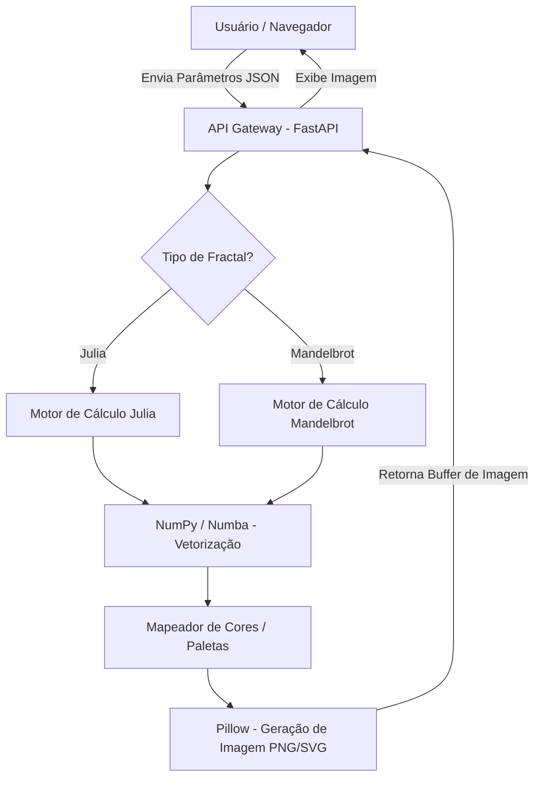

# 🌀 Gerador de Fractais Julia & Mandelbrot

Este projeto é uma aplicação completa (Fullstack) para exploração e geração de fractais matemáticos **Julia** e **Mandelbrot**. Desenvolvido como parte dos requisitos da disciplina de Matemática Computacional (PRJ.3).

O sistema permite gerar imagens em alta resolução (PNG) e vetores (SVG) através de uma interface web moderna ou via linha de comando (CLI).

---

## 🔗 Apresentação do Projeto

Você pode conferir a apresentação completa deste projeto no Prezi através do link abaixo:
👉 **[Ver Apresentação no Prezi](https://prezi.com/view/tEgvkw4Jpm5mpe2H4J8O/?referral_token=ODZ4iOlnB3FN)**

---

## 🚀 Como Iniciar o Projeto

Siga os passos abaixo para configurar e rodar a aplicação em sua máquina.

### 📋 Pré-requisitos
*   **Python 3.10 ou superior** (Recomendado usar o instalador oficial do python.org).
*   **Node.js 18 ou superior** (Para o frontend).

### 1️⃣ Configuração do Backend (Python)
Abra um terminal na raiz do projeto:

1.  **Instale as dependências:**
    ```powershell
    py -m pip install -r requirements.txt
    ```
2.  **Inicie o servidor da API:**
    ```powershell
    py -m uvicorn app.api:app --reload
    ```
    *O servidor estará disponível em: `http://127.0.0.1:8000`*

### 2️⃣ Configuração do Frontend (React + Vite)
Abra um **segundo terminal** na pasta `frontend`:

1.  **Navegue até a pasta:** `cd frontend`
2.  **Instale as dependências:**
    ```bash
    npm install
    ```
3.  **Inicie a interface:**
    ```bash
    npm run dev
    ```
    *Acesse no navegador através do link exibido (ex: `http://localhost:5173`).*

---

## 🎨 Guia de Exploração (Modelos de Fractais)

Para ver a "mágica" acontecer, use os parâmetros abaixo na interface web:

### 🌟 Conjuntos de Julia (Mude `real` e `imag`)
*Dica: Mantenha o `step` (zoom) entre 0.004 e 0.006 para ver o fractal inteiro.*

| Nome do Modelo | Componente Real | Componente Imag | Descrição |
| :--- | :---: | :---: | :--- |
| **Espirais Galácticas** | `0.285` | `0.01` | Duas grandes espirais conectadas por pontes finas. |
| **O Dragão Espinhoso** | `-0.123` | `0.745` | Uma estrutura densa e agressiva com ramificações infinitas. |
| **Labirinto de Cristal** | `-0.8` | `0.156` | Formas geométricas que lembram cristais de gelo. |
| **Floco de Neve Orgânico**| `-0.4` | `0.6` | Ramificações que lembram o crescimento de corais ou cactos. |
| **Dendritos** | `0.0` | `0.8` | Cadeias de círculos perfeitos se repetindo infinitamente. |

### 🔍 Conjunto de Mandelbrot
O Mandelbrot é o "mapa" de todos os Julia. Para explorá-lo, mude o tipo para **Mandelbrot** e use estes pontos:
*   **O Coração**: `real: -0.5, imag: 0, step: 0.005`
*   **Vale dos Cavalos-Marinhos**: `real: -0.743, imag: 0.131, step: 0.0001`
*   **Vale Triplo**: `real: -0.16, imag: 1.03, step: 0.001`

---

## 🛠️ Tecnologias Utilizadas

*   **Backend:** Python 3.14, FastAPI (API REST), NumPy (Cálculos matemáticos vetoriais), Numba (Aceleração JIT), Pillow (Processamento de imagem).
*   **Frontend:** React 19, TypeScript, Vite, CSS moderno com Dark Mode.
*   **CLI:** Módulo Python `argparse` para geração via terminal.

---

## 🏗️ Arquitetura do Sistema

A aplicação segue uma arquitetura moderna de desacoplamento entre cliente e servidor, garantindo que o processamento pesado de cálculos matemáticos fique centralizado no Backend.

### Fluxo de Dados



### Componentes Principais

1.  **Frontend (React + Vite)**: 
    *   Gerencia o estado dos parâmetros (Real, Imag, Step, Paleta).
    *   Faz chamadas assíncronas para a API e lida com o render de Blobs de imagem.
2.  **Backend (FastAPI)**:
    *   Valida os tipos de dados e limites de segurança (ex: largura máxima da imagem).
    *   Coordena a execução dos algoritmos matemáticos.
3.  **Core (NumPy & Numba)**:
    *   **Vetorização**: Em vez de calcular pixel por pixel em loops lentos de Python, o sistema trata a tela inteira como uma matriz NumPy, disparando cálculos em massa.
    *   **Suavização Log-Log**: Aplica uma correção matemática para evitar "bandas" de cores, criando gradientes suaves e profissionais.
4.  **CLI (Command Line Interface)**:
    *   Permite a integração do motor de cálculo com outros scripts ou automações sem a necessidade de uma interface gráfica.

---

## 📐 Detalhes de Implementação (Requisitos PRJ.3)

Este projeto atende integralmente aos requisitos:
- **Cálculo de Divergência:** Utiliza algoritmos de tempo de escape com suavização contínua (Log-Log) baseada na magnitude e iteração.
- **Coloração:** Escalas de cores com pelo menos 6 níveis (Paletas: Viridis, Plasma, Inferno, etc).
- **Entradas:** Controle total sobre componentes reais/imaginárias, passo (resolução) e tipo de conjunto.
- **Backend:** 100% desenvolvido em Python.

---

## 🖥️ Uso via Linha de Comando (CLI)

Você também pode gerar fractais sem abrir o navegador:
```powershell
py -m app generate --type julia --real -0.7 --imag 0.27 --step 0.002 --out meu_fractal.png
```

---
**Desenvolvido por:** [Felipe Faria Machado](https://github.com/felipefmac)
